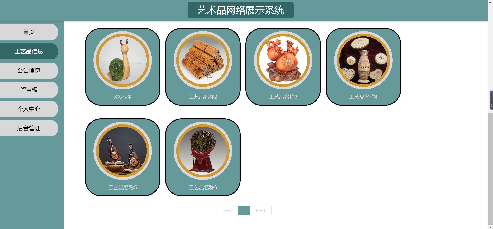
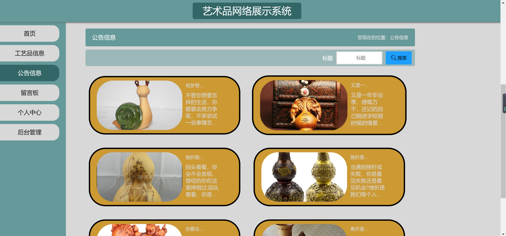
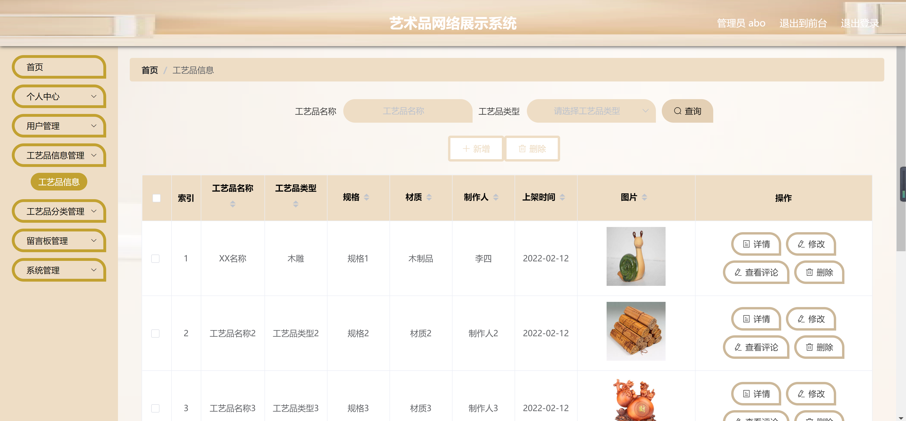
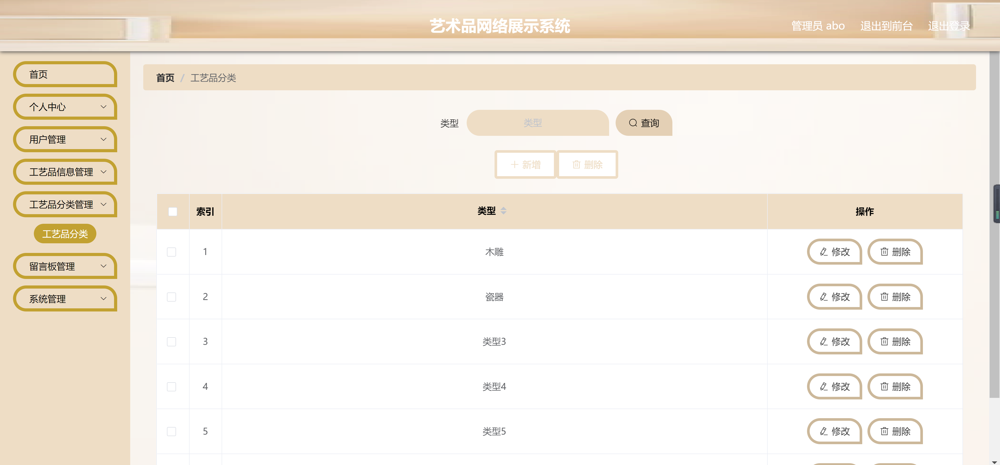

<h1 align="center">艺术品网络展示管理系统</h1>

## 简介
艺术品网络展示管理系统：角色分为管理员、用户；功能包括工艺品信息管理、用户管理、分类管理、公告展示、留言管理，提供简洁易用的网络平台用于艺术品展示与管理。    --计算机毕业设计源码；毕设源码；java毕业设计源码

## 联系方式

<h3 align="center">获取完整代码与数据库文件 + 微信：bysj5151 QQ: 86050149 QQ群: 783742310</h3>

<h3 align="center">可帮忙远程部署 包运行成功！提供远程部署、修改代码、设计文档指导、代码讲解等服务！</h3>

## 功能介绍（完整见运行截图）
管理员：基本功能包括系统登录，首页导航提供用户管理、工艺品信息管理、公告信息管理、分类管理和系统管理等功能，能够新增、修改、删除和查看工艺品、分类及公告信息。管理员可以管理留言板和系统公告，支持查看用户留言与交流记录，以及执行系统后台管理任务。

普通用户：可以通过系统登录进入首页，通过导航栏访问工艺品展示页，以表格形式或图片形式查看工艺品详情，支持通过查询、新增、删除等功能进行信息管理。用户个人中心提供信息查看及修改功能，并可查看留言板和系统公告，提供便捷的内容管理与互动体验。

## 运行截图

本代码来源于网络,仅供学习参考使用!

